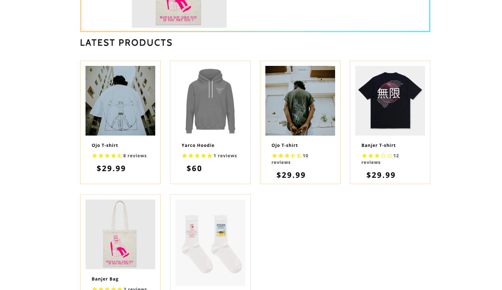
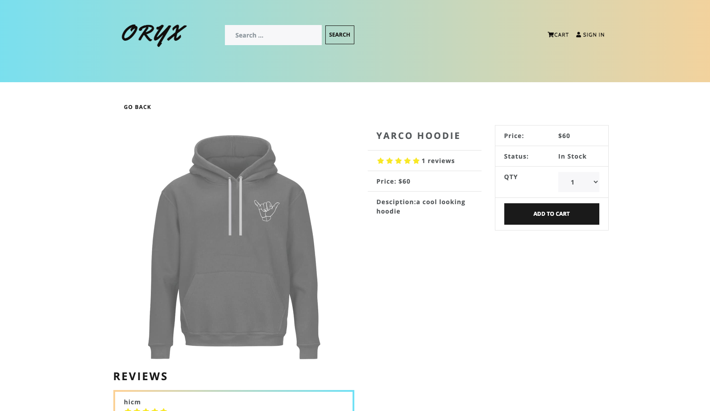

# Oryx E-Commerce MERN Stack Application

## Description

Welcome to the Oryx MERN Stack Application repository. This project demonstrates a full-fledged E-Commerce platform developed using the MERN stack (MongoDB, Express.js, React, Node.js) along with Redux for state management.

## Features

- Browse and search products.
- User registration, login, and authentication.
- Shopping cart management with Redux.
- Secure payment processing for purchases.
- Order history and management.
- Responsive design for optimal user experiences.

## Getting Started

1. Clone this repository: `git clone https://github.com/Supaflava/OryxApp`
2. Navigate to the project directory: `cd fennec`
3. Navigate to the project directory: `cd fennec`
4. Install backend dependencies: `npm install`
5. Navigate to the frontend directory: `cd frontend`
6. Install frontend dependencies: `npm install`
7. Return to the project directory: `cd ..`
8. Set up MongoDB connection in `backend/config/db.js`.
9. Load sample data into the database: `npm run data:import`
10. Start the development server: `npm run dev`
    You can access the application at: `http://localhost:3000`

## Technologies

- MongoDB
- Express.js
- React
- Node.js
- Redux

## Still to be Done

- Address minor design bugs.
- Enhance UI/UX design.
- Optimize performance.

## Contributing

Contributions are welcome! Please submit pull requests for improvements or fixes.

## License

This project is licensed under the MIT License.
